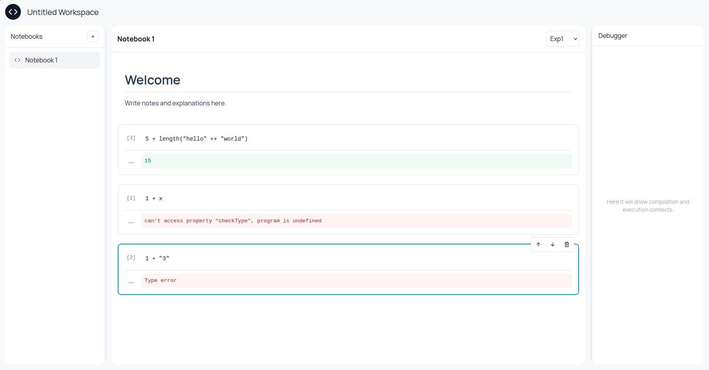

# colab.io

Web-based IDE para a disciplina de Paradigmas de Linguagens de Programação

  

---

## Equipe

| Nome | E-mail |
|------|--------|
| Matheus Vinicius Teotonio do Nascimento Andrade | mvtna@cin.ufpe.br |
| Uanderson Ricardo Ferreira da Silva | urfs@cin.ufpe.br |

---

## Sobre o projeto

O **colab.io** é uma IDE web voltada ao exercício dos conceitos e linguagens estudados na disciplina de PLP (Paradigmas de Linguagens de Programação). O ambiente oferece uma interface intuitiva e acessível pelo navegador, permitindo que os alunos escrevam, executem e documentem código de forma incremental, no estilo de notebooks interativos.

A aplicação é inspirada no **Google Colab** e permite criar workspaces com múltiplos notebooks, divididos em células independentes — uma por linguagem, uma por conceito, no ritmo de cada aluno.



---

## Funcionalidades

- 📓 **Notebooks** — Crie workspaces com múltiplos arquivos e organize seu código em células executáveis.
- ▶ **Execução** — Execute código diretamente no navegador, com suporte às linguagens da disciplina.
- 🔤 **Multi-linguagem** — Suporte implementado para Exp1, Exp2, Func1 e Func2.
- 📝 **Documentação** — Adicione anotações e documentação junto ao código, em células de texto livre.

---

## Status das linguagens

O objetivo atual é converter os parsers das demais linguagens para TypeScript.

| Linguagem | Status |
|-----------|--------|
| Exp1 | ✅ Suportada |
| Exp2 | ✅ Suportada |
| Func1 | ✅ Suportada |
| Func2 | ✅ Suportada |
| Demais linguagens de PLP | 🚧 Em desenvolvimento |

> As BNFs de todas as linguagens estão disponíveis em: https://augustosampaio.github.io/PLP/linguagens

---

## Exemplos suportados

### Exp1

```txt
1 + 2
```

### Exp2

```txt
let var x = 10, var y = 5 in x - y
```

### Func1

```txt
let fun soma x y = x + y in soma(2,3)
```

### Func2

```txt
let fun add x = fn y . x + y in
	let var id = add(0), var x = 4 in
		id(1) + x
```

---

## Como rodar

```bash
git clone https://github.com/uandersonricardo/projeto-plp
cd projeto-plp
npm install
npm run dev
```

---

## Referências

- 🔗 [Repositório GitHub](https://github.com/uandersonricardo/projeto-plp)
- 📖 [BNFs das linguagens](https://augustosampaio.github.io/PLP/linguagens)
- 💡 [Inspiração: Google Colab](https://colab.research.google.com)

---

<sub>Universidade Federal de Pernambuco · Centro de Informática · IN1007 2026.1 — Paradigmas de Linguagens de Programação</sub>
